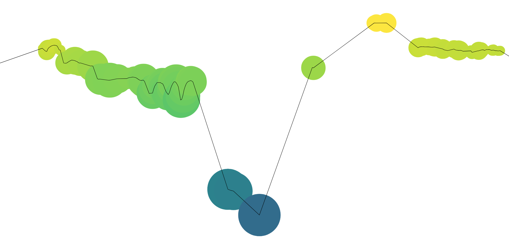

# Visual Notation
Taggart Bonham
April 2018

## Overview


This code creates notation to allow the visualization of music. Based on the pitch of an inputted `.wav` file, a roadmap of the audio is created. The track is processed as well for the loudness at each frame (as measured in decibels). After the first pass, the track is processed based on the confidence of recorded pitch to remove sound fragments that are likely non-notes. A plot is generated showing a continuous line of the pitch during the track. Each instance of a sound, a bubble is displayed where its radius is a function of the current decibels and its color is a function of the pitch. The plot is saved as a `.SVG` file for compression reasons due to the large amount of whitespace.


The final version morphed out of working to add in various filters and sound analysis tools. To see various steps along the way, checkout the [output](output/) folder.

## Installation
```
# Make & enter a new virtual environment for the music project
python3 -m virtualenv mp
source notproj/bin/activate

#Install required libraries
pip install git+https://git.aubio.org/aubio/aubio/
pip install matplotlib
```

## Running

```
python3 src/visualize.py input/path/to/file.wav

```

## Acknowledgment
This project was made possible by:

* [Aubio](www.aubio.com) - Audio processing
* [Matplotlib](https://matplotlib.org/) - Plotting
